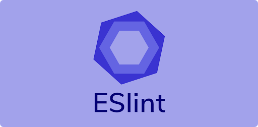

# Práctica Mejora Proyecto Cliente con Github Actions

#### Vicente Andani Auñón

## 1. BINGO

Es un proyecto realizado en la asignatura de **Cliente** en el cual tenemos un modo Offline y un modo Online, todo el proyecto esta realizado con **JS**.

Se trata del clásico juego del **Bingo** pero en versión web.

En el modo Offline tu mismo puedes añadir a jugadores y es todo automático, después esta el modo Online que funciona por websockets (socket.io) añades tu nombre y juegas con usuarios Online _(sin necesidad de registrarte)_.

### 1.1 Tecnologias utilizadas

#### 1.1.1 Javascript ES6

**JavaScript** es un lenguaje de programación o de secuencias de comandos que te permite implementar funciones complejas en páginas web, cada vez que una página web hace algo más que sentarse allí y mostrar información estática para que la veas, muestra oportunas actualizaciones de contenido, mapas interactivos, animación de Gráficos 2D/3D, desplazamiento de máquinas reproductoras de vídeo, etc., puedes apostar que probablemente JavaScript está involucrado.

En concreto estamos utilizando **ECMAScript** en su versión 6.
ECMAScript es el estándar que define como debe ser el lenguaje **JavaScript**, en concreto la versión ES6 es ECMAScript 2015.

#### 1.1.2 NodeJS

**Node.js** es un entorno de tiempo de ejecución de JavaScript, utiliza un modelo de entrada y salida sin bloqueo controlado por eventos que lo hace ligero y eficiente.

Puede referirse a cualquier operación, desde leer o escribir archivos de cualquier tipo hasta hacer una solicitud HTTP.

#### 1.1.3 Socket io

**Socket.io** es una librería en JavaScript para Node.js que permite una comunicación bidireccional en tiempo real entre cliente y servidor.

Para ello se basa principalmente en Websocket.

Es importante resaltar que las aplicaciones hechas en **Socket.io** tiene una desventaja y es que no soportan interacciones con otros clientes que usen Websocket estándar.

#### 1.1.4 Webpack

**Webpack** se define como un empaquetador de módulos.

Es una herramienta extremadamente útil cuando desarrollas aplicaciones web diseñadas con filosofía modular, es decir, separando el código en módulos que luego se utilizan como dependencias en otros módulos.

## 2. Mejorar Proyecto con Github Actions

En la siguiente práctica vamos a mejorar este proyecto con **Github Actions**, creando acciones que verifiquen la estructura del codigo, la sintaxis, que realicen los test y más.

### 2.1 Tecnologias utilizadas

#### 2.1.1 Github Actions

**GitHub Actions** permite crear flujos de trabajo (workflows) que se pueden utilizar para compilar, probar y desplegar código, dando la posibilidad de crear flujos de integración y despliegue continuo dentro del propio repositorio de git.

Los flujos de trabajo tienen que contener al menos un job. Estos incluyen una serie de pasos que ejecutan tareas individuales que pueden ser acciones o comandos. Un flujo de trabajo puede comenzar por distintos eventos que suceden dentro de **GitHub**, como un push al repositorio o un pull request.

#### 2.1.2 ESLint

**ESLint** es un linter que examina código Javascript, siguiendo unas ciertas normas y criterios personalizables por el programador, para que el código **Javascript** siga ciertos estándares y estilos, favoreciendo la escritura de código de calidad.

#### 2.1.3 Jest

**Jest** es un sistema de testing de codigo.

**Jest** corre los tests en paralelo de forma distribuida en diversas instancias para maximizar el rendimiento.

La salida de consola es almacenada en un buffer para mostrarse más tarde con los resultados del **test**. Se reiniciara automáticamente los entornos aislados y el estado global para cada **test**. De esta forma nunca dos **tests** entraran en conflicto el uno con el otro.

#### 2.1.4 Nodemailer

Nodemailer es un módulo que nos permitirá añadir estas funcionalidades en nuestro servidor Node.js.

Lo puedes configurar perfectamente con gmail, que es como lo hemos utilizado en esta práctica.
