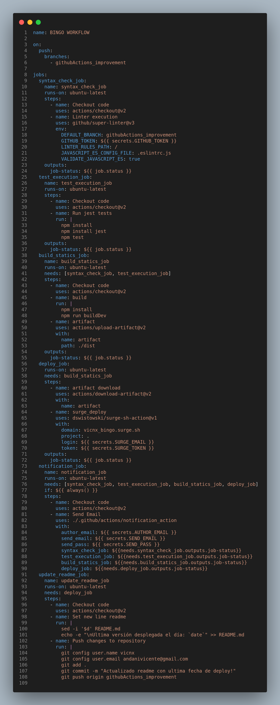
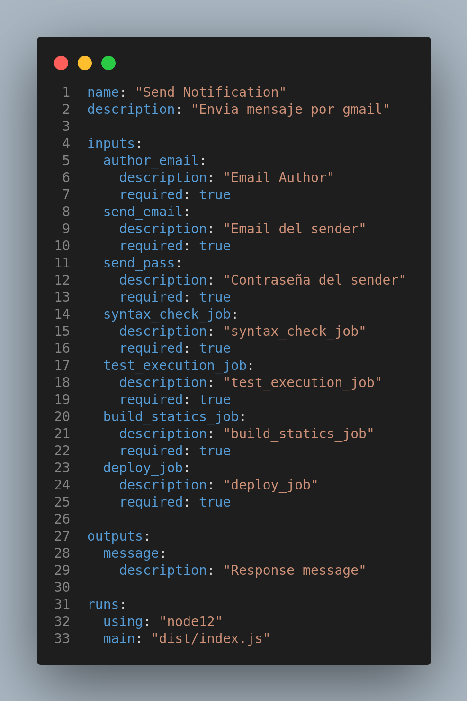

# Práctica Mejora Proyecto Cliente con Github Actions

#### Vicente Andani Auñón

## ÍNDICE

- 1.Bingo

  - 1.1 Tecnologias utilizadas
    - 1.1.1 Javascript ES6
    - 1.1.2 NodeJS
    - 1.1.3 Socket io
    - 1.1.4 Webpack

- 2.Mejorar Proyecto con Github Actions

  - 2.1 Tecnologias utilizadas

    - 2.1.1 Github Actions
    - 2.1.2 ESLint
    - 2.1.3 Jest
    - 2.1.4 Nodemailer
    - 2.1.5 Surge sh

  - 2.2 Desarrollo
    - 2.2.1 Creación de la estructura y workflow
    - 2.2.2 Job de verificación de sintaxis correcta
    - 2.2.3 Job de ejecución de test
    - 2.2.4 Job de generación de estáticos
    - 2.2.5 Job de despliegue de los estáticos generados
    - 2.2.6 Job de envío de notificación a los usuarios del proyecto
    - 2.2.7 Job de actualización del README principal del proyecto

- 3.Comprobaciones

## 1. BINGO

Es un proyecto realizado en la asignatura de **Cliente** en el cual tenemos un modo Offline y un modo Online, todo el proyecto esta realizado con **JS**.

Se trata del clásico juego del **Bingo** pero en versión web.

En el modo Offline tu mismo puedes añadir a jugadores y es todo automático, después esta el modo Online que funciona por websockets (socket.io) añades tu nombre y juegas con usuarios Online _(sin necesidad de registrarte)_.

### 1.1 Tecnologias utilizadas

#### 1.1.1 Javascript ES6

**JavaScript** es un lenguaje de programación o de secuencias de comandos que te permite implementar funciones complejas en páginas web, cada vez que una página web hace algo más que sentarse allí y mostrar información estática para que la veas, muestra oportunas actualizaciones de contenido, mapas interactivos, animación de Gráficos 2D/3D, desplazamiento de máquinas reproductoras de vídeo, etc., puedes apostar que probablemente JavaScript está involucrado.

En concreto estamos utilizando **ECMAScript** en su versión 6.
ECMAScript es el estándar que define como debe ser el lenguaje **JavaScript**, en concreto la versión ES6 es ECMAScript 2015.

#### 1.1.2 NodeJS

**Node.js** es un entorno de tiempo de ejecución de JavaScript, utiliza un modelo de entrada y salida sin bloqueo controlado por eventos que lo hace ligero y eficiente.

Puede referirse a cualquier operación, desde leer o escribir archivos de cualquier tipo hasta hacer una solicitud HTTP.

#### 1.1.3 Socket io

**Socket.io** es una librería en JavaScript para Node.js que permite una comunicación bidireccional en tiempo real entre cliente y servidor.

Para ello se basa principalmente en Websocket.

Es importante resaltar que las aplicaciones hechas en **Socket.io** tiene una desventaja y es que no soportan interacciones con otros clientes que usen Websocket estándar.

#### 1.1.4 Webpack

**Webpack** se define como un empaquetador de módulos.

Es una herramienta extremadamente útil cuando desarrollas aplicaciones web diseñadas con filosofía modular, es decir, separando el código en módulos que luego se utilizan como dependencias en otros módulos.

## 2. Mejorar Proyecto con Github Actions

En la siguiente práctica vamos a mejorar este proyecto con **Github Actions**, creando acciones que verifiquen la estructura del codigo, la sintaxis, que realicen los test y más.

### 2.1 Tecnologias utilizadas

#### 2.1.1 Github Actions

**GitHub Actions** permite crear flujos de trabajo (workflows) que se pueden utilizar para compilar, probar y desplegar código, dando la posibilidad de crear flujos de integración y despliegue continuo dentro del propio repositorio de git.

Los flujos de trabajo tienen que contener al menos un job. Estos incluyen una serie de pasos que ejecutan tareas individuales que pueden ser acciones o comandos. Un flujo de trabajo puede comenzar por distintos eventos que suceden dentro de **GitHub**, como un push al repositorio o un pull request.

#### 2.1.2 ESLint

**ESLint** es un linter que examina código Javascript, siguiendo unas ciertas normas y criterios personalizables por el programador, para que el código **Javascript** siga ciertos estándares y estilos, favoreciendo la escritura de código de calidad.

#### 2.1.3 Jest

**Jest** es un sistema de testing de codigo.

**Jest** corre los tests en paralelo de forma distribuida en diversas instancias para maximizar el rendimiento.

La salida de consola es almacenada en un buffer para mostrarse más tarde con los resultados del **test**. Se reiniciara automáticamente los entornos aislados y el estado global para cada **test**. De esta forma nunca dos **tests** entraran en conflicto el uno con el otro.

#### 2.1.4 Nodemailer

**Nodemailer** es un módulo que nos permitirá añadir estas funcionalidades en nuestro servidor Node.js.

Lo puedes configurar perfectamente con gmail, que es como lo hemos utilizado en esta práctica.

#### 2.1.5 Surge sh

**Surge.sh** ofrece una publicación web simple y de un solo comando.

Publique HTML, CSS y JS de forma gratuita, sin salir de la línea de comandos.

### 2.2 Desarrollo

Esta práctica consistirá en aplicar una serie de mejoras sobre el proyecto realizado
en la asignatura de **Cliente** del primer trimestre **_(Bingo_JS_**), los cambios a
realizar consistirán en configurar un nuevo **workflow** dentro del proyecto
denominado **Bingo_Workflow**.

Dicho workflow sólo se ejecutará cuando se realice un push en la rama creada **_(githubActions_improvement)_** y estará compuesto por los siguientes jobs:

- **Job de verificación de sintaxis correcta.** Se encargará de realizar la descarga del proyecto y de verificar que la sintaxis utilizada es correcta en los ficheros javascript.
- **Job de ejecución de test.** Se encargará de ejecutar los test del Bingo y verificar que todos funcionan como se esperaba.
- **Job de generación de estáticos.** Se encargará de realizar el proceso de compilado del proyecto, siempre que hayan terminado los 2 jobs anteriores.
- **Job de despliegue de los estáticos generados.** Se ejecutará después del job anterior y desplegará el proyecto en surge.sh.
- **Job de envío de notificación a los usuarios del proyecto.** Ejecutará una acción propia que podrá basarse en Javascript o Docker, se ejecutará siempre (aunque haya error en algún job previo). Enviará un mensaje por correo con:

  - Destinatario: dirección de correo vuestra personal tomada de un secret de github
  - Asunto: Resultado del workflow ejecutado
  - Cuerpo del mensaje:

    Se ha realizado un push en la rama githubActions_improvement que ha provocado la ejecución del workflow Bingo_Workflow con los siguientes resultados:

    - syntax_check_job: resultado asociada
    - test_execution_job: resultado asociada
    - build_statics_job: resultado asociada
    - deploy_job: resultado asociada

- **Job de actualización del README principal del proyecto.** Se ejecutará sólo si el job encargado de realizar el deploy ha funcionado correctamente. Su finalidad es actualizar el contenido del **README** principal del proyecto para que muestre un text al final con **_“Ultima versión desplegada el día: FECHA*DE*ÚLTIMO_DESPLIEGUE”_**

#### 2.2.1 Creación de la estructura y workflow

Primero vamos a crear la estructura en el proyecto, para ello creamos una carpeta con el nombre **.github** y dentro de ella otra llamada **workflows**.

Aquí dentro creamos un archivo yml **(Bingo_Workflow.yml)** donde estará el workflow.

Dentro del archivo del workflow **(Bingo_Workflow.yml)** empezamos por asignarle el nombre **BINGO WORKFLOW**, seguidamente configuramos para que se ejecute cuando detecte un **_push_** en la rama **githubActions_improvement**

Ahora ya podemos empezar con los jobs. El primer job es el de **verificación de sintaxis correcta**.

#### 2.2.2 Job de verificación de sintaxis correcta

Para este job utilizaremos el archivo **.eslintrc.js** ya creado en el proyecto **_(con el que hemos realizado el proyecto del Bingo) _**

Tambien vamos a crear un **.eslintignore** _(sirve para ignorar determinados archivos que no queramos que compruebe el job)_

En este archivo pondremos la carpeta **doc** **_(que es documentación del proyecto y no nos interesa que le verifique la sintaxis)_** y cualquier archivo de test.

Una vez creado el .eslintignore y revisado el .eslintrc.js ya podemos empezar con la creación del job.

Le asignaremos el nombre de **syntax_check_job**, le indicamos también que se ejecute en un ubuntu y que tenga los siguientes pasos:

- **Checkout code** _(descarga los archivos necesarios del repo)_
- **Linter execution** el paso de verificación de sintaxis que tendremos que configurar lo siguiente:
  - Indicarle la rama donde se ejecutará
  - El Token de github.
  - Donde se encuentran las reglas de Linter.
  - El archivo que queremos utilizar para las reglas (en este caso colocamos el que ya teníamos del proyecto)
  - Y le indicamos que valide JS

Una vez configurado podemos comprobarlo rápidamente realizando un push de esa rama.

Después nos dirigimos al repositorio en Github y en el apartado de Action veremos la accion finalizada correctamente.

Ahora vamos a continuar con el siguiente job, que es el de los **JEST tests**.

#### 2.2.3 Job de ejecución de test

Para que funcione correctamente antes de empezar tendremos que realizar unos cambios en los archivos de test. _(los imports estan mal colocados)_

Una vez reparados los imports y probado en local ya podemos continuar con la creación del JOB.

Al job habrá que indicarle que haga un **_npm install_** para instalar las dependencias del repo, que **_instale jest_** y que ejecute el comando **_npm test_** _(previamente configurado en el package.json)_.

También le indico que para ejecutarse necesita que el job **syntax_check_job** se haya ejecutado. _(esta linea más adelante la quitaremos ya que no era necesaria, este job puede ejecutarse sin necesidad de esperar al anterior)_

Una vez añadido el job al workflow podemos realizar un push para comprobar que los dos jobs funcionan correctamente.

Ahora vamos a continuar con el siguiente job, que es el de **generación de estáticos**.

#### 2.2.4 Job de generación de estáticos

Para realizar este job tenemos que tener configurado en **package.json** un script que cree un **build**.

Una vez revisado que tenemos configurado correctamente el **package.json** podemos añadir el job al **workflow**:

Indicamos el nombre del job y que dependa de los jobs anteriores.

Este job tendrá varios steps, el primero es bajarse el codigo como siempre, después tendrá un step que que ejecutara un **_npm install_** para instalar las dependencias y un **_npm run buildDev_** para crear los estáticos, después tendrá otro step que se encargará de **_subirlo al artifact_** para posteriormente descargarlo y desplegarlo en **surge** **_(le indicamos la carpeta que tiene que subir)._**

Una vez realizado el job hacemos un push para comprobar que hasta ahora todo funciona correctamente.

Ahora continuamos con el siguiente job que se trata de **desplegar el proyecto en surge**.

#### 2.2.5 Job de despliegue de los estáticos generados

Para realizar este job previamente tenemos que configurar nuestros secrets de **surge** en **Github**.

Asi que vamos a instalar **surge** en nuestro ordenador con la orden **_npm install -g surge_**.

Una vez instalado vamos a ejecutar **surge** **(si es la primera vez que se ejecuta nos pedirá un usuario y una contraseña)**, le asignamos el proyecto y un dominio para comprobar que funciona correctamente.

Ahora tendremos que añadir los secrets a nuestro repositorio de github, nos dirigimos a ajustes y Secrets y tenemos que crear dos:

- Uno que contendra el email de surge **(SURGE_EMAIL)**
- Otro que contendrá el token de surge **(SURGE_TOKEN**). Para encontrar el token tenemos que escribir en la terminal **_surge token_**.

Una vez configurado el repositorio podemos continuar con la creación del JOB en el **workflow**.

Le indicamos que se ejecute después de construir los estáticos.

Tendrá dos steps:

- El primero será para descargar los estáticos de artifact.
- El segundo para montarlo en **surge** en el cual tenemos que indicarle el dominio en mi caso **_vicnx_bingo.surge.sh_** y los secrets anteriormente creados.

Ahora vamos a realizar un push para comprobar que todo funciona correctamente.

Ahora si nos dirigimos al dominio asignado **_(http://vicnx_bingo.surge.sh/)_** veremos como esta la app funcionando correctamente.

Vamos con el siguiente job, que es el de envío de notificación a los usuarios del proyecto.

#### 2.2.6 Job de envío de notificación a los usuarios del proyecto

Antes de empezar a crear la **ACTION** vamos a añadir **_tres SECRETS_** nuevos:

- **AUTHOR_EMAIL**: Será el correo donde enviaremos la notificación. _(andanivicente@gmail.com)_
- **SEND_EMAIL**: El correo el cual enviara la notificación _(andanivicente.test@gmail.com)_
- **SEND_PASS**: La contraseña de ese correo.

Para realizar esta actividad he creado una nueva cuenta de GMAIL _(andanivicente.test@gmail.com)_ desde la cual se enviará el correo a los usuarios del proyecto.

Tambien en la cuenta desde donde se enviara el correo _(andanivicente.test@gmail.com)_ tenemos que acceder a la siguiente URL y activar el acceso de aplicaciones poco seguras (_si no google lo bloquea y no funciona en el envio)_
https://myaccount.google.com/lesssecureapps

Una vez configurados los secrest y activado el acceso de app poco seguras podemos continuar creando la estructura para la acción.

En la carpeta **_notification_action_** tenemos que realizar un **_npm init_** y crear un **_index.js_**.

Tambien instalaremos **nodemailer** y **@actions/core** _(para obtener los inputs del workflow)_.

También instalaremos **vercel** en global para crear la **dist**.

El archivo action.yml quedará asi:

Aquí podemos ver que hay un input para cada secret anteriormente creado y ademas hemos añadido un input por cada job que queremos saber su estado.

Ahora vamos a crear un archivo **index.js** donde estará el codigo de la acción.

Vamos a explicar un poco el codigo de esta acción:

Primero importamos la libreria **nodemailer** _(previamente instalada en el proyecto)_

Tambien vamos a importar el **core** para poder obtener los inputs del archivo **_action.yml_** que este recogera del workflow.

Realizando pruebas me di cuenta que si un job es **"skipped"** _(se ha saltado porque el job del que dependia ha fallado)_ no aparece, _(más adelante veremos como recojo el estado de cada job)_ asi que he creado una funcion que comprueba si el texto del job esta vacio significa que esta skipped.

Después creamos el transporter _(es el encargado de enviar el correo electronico)_, aquí vamos a introducir los datos del secret _(recogidos poe el input)_.

Seguidamente tenemos el texto del correo donde pondremos quien es el remitente y a quien va dirigido _(todo esto con los secrets previamente creados)_, tambien introducimos el texto a enviar.

Finalmente enviamos el correo.

Ahora vamos a realizar unos cambios en TODOS los jobs del workflow.

En cada job tenemos que añadir lo siguiente para poder recoger ele stado de ese job.

Y el nuevo job quedará asi:

Este job tendrá que ejecutarse siempre asi que en el **workflow** tendremos que añadir la linea **_if: ${{ always() }}_** al job y ponerle que se ejecute después de todos los otros.

Le indicamos que utilice la acción previamente creada enviandole todos los inputs que necesita.

Para recoger el estado del job tendremos que enviarlo como se ve en la imagen.

Al realizar pruebas me di cuenta que en el **.gitignore** estaba la carpeta **DIST** asi que tendremos que dejar de ignorarla ahi y añadirla al **.eslintignore** _(para que no compruebe la sintaxis)_

Peró para realizazr una prueba del mensaje si falla algun job o si es skipped no la he añadido aun al **.eslintignore** para que ese job falle y los que dependen de el sean skipped _(asi poder ver el cuerpo del mensaje en ese caso)_

Antes de realizar un push tenemos que crear una **DIST** con el **vercel**:

Ahora realizamos el push y veremos como el job **syntax_check_job** falla y los otros son skipped. _(y aun asi el notification job se ejecuta)_

Y ahora una captura del mensaje que he recibido al correo personal:

Ahora dejamos el **_.eslintignore_** como estaba _(ignorando la carpeta dist)_ y realizamos otra prueba para que se vea que todos los jobs se han ejecutado correctamente.

Y el mensaje recibido:

Ahora vamos a continuar con el último job que tiene que **modificar el README principal del proyecto**.

#### 2.2.7 Job de actualización del README principal del proyecto

Para realizar este job tenemos que decirle que dependa del job **deploy_job**, después tendrá tres steps:

- El primero es para bajarse el codigo del repo.
- Después añadirá una linea al **README.md**. Primero tenemos que borrar la última linea _(de eso se ocupa el comando sed)_ y después insertamos la nueva.
- Y el ultimo es para realizar el **push** con el cambio.

El comando **sed -1 '$d' README.md** elimina la ultima linea del README.md, después con el **echo >> README.md** añadimos una linea al README.

He utilizado la variable **date** de bash para coger la fecha actual.

Despues el siguiente paso se encarga de realizar un commit y un push del cambio. Hay que configurar un usuario y el correo personal de Github.

Ahora solo queda ejecutarlo y ver que funciona correctamente.

Y como podemos ver ha modificado el readme.md correctamente.

## 3. Comprobaciones

Aquí adjunto capturas de archivos completos y comprobaciones.

Estrcutura:

Bingo_Workflow.yml:

notification_action/action.yml:

Todos los jobs funcionando:

Correo enviado todo correcto:

Readme modificado:

